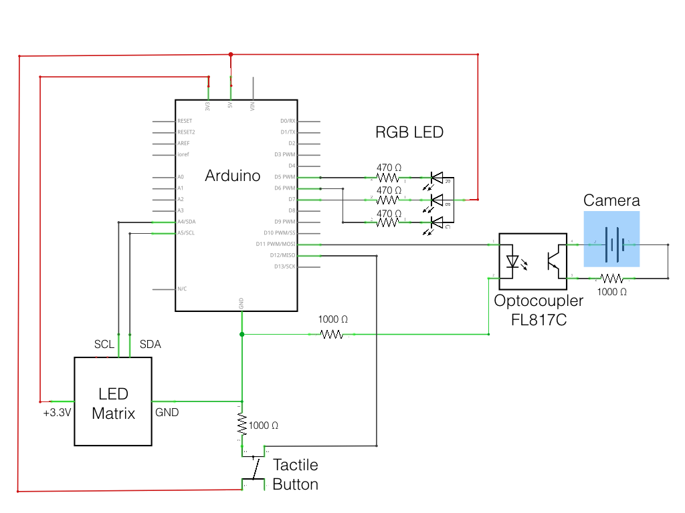
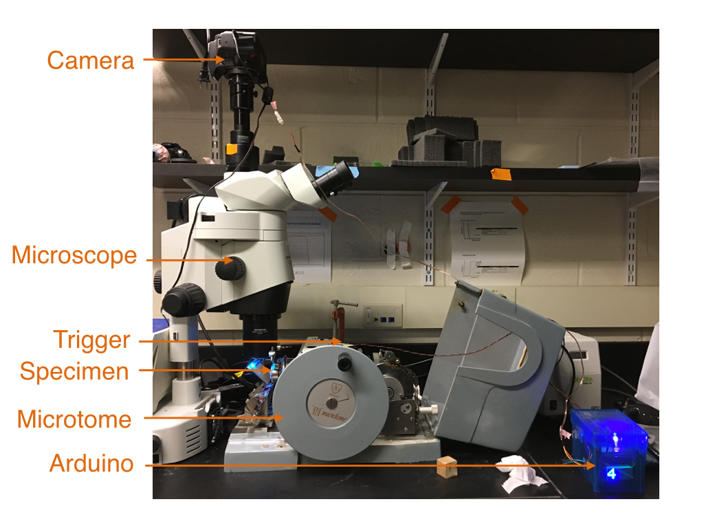
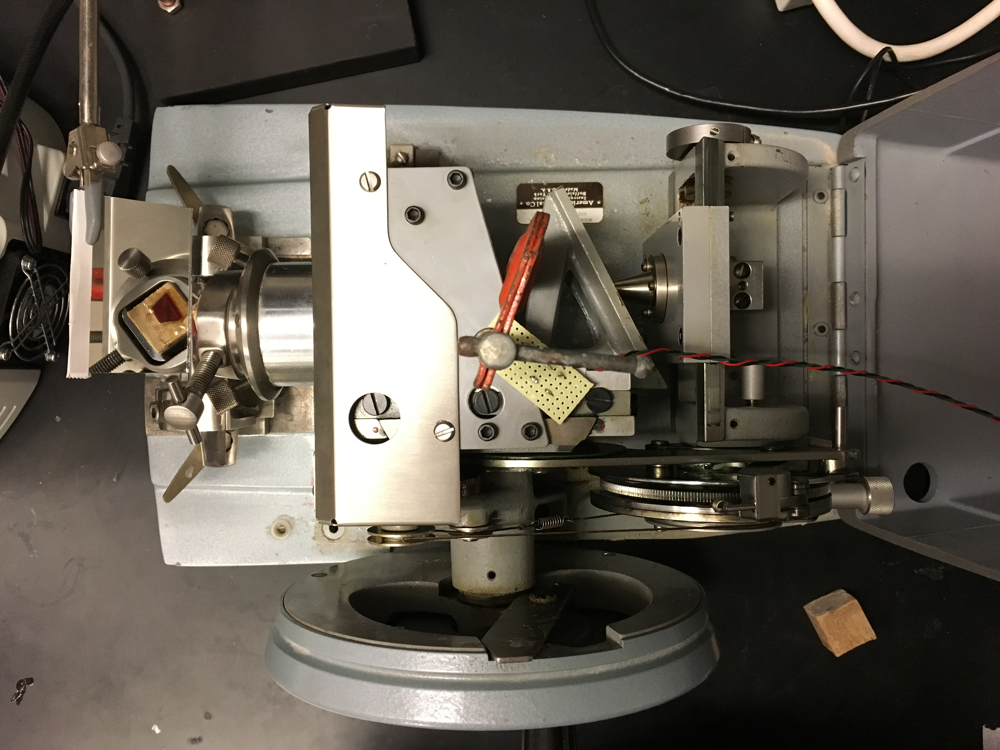
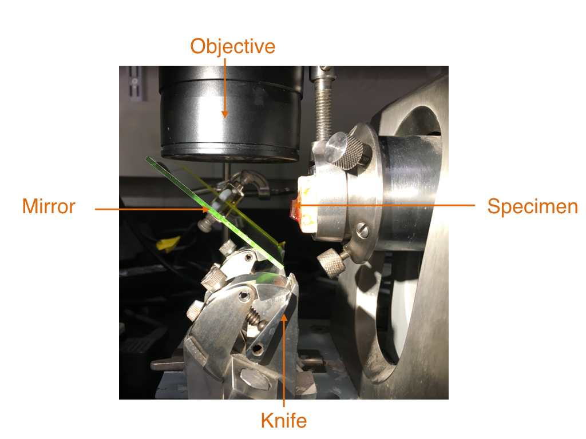
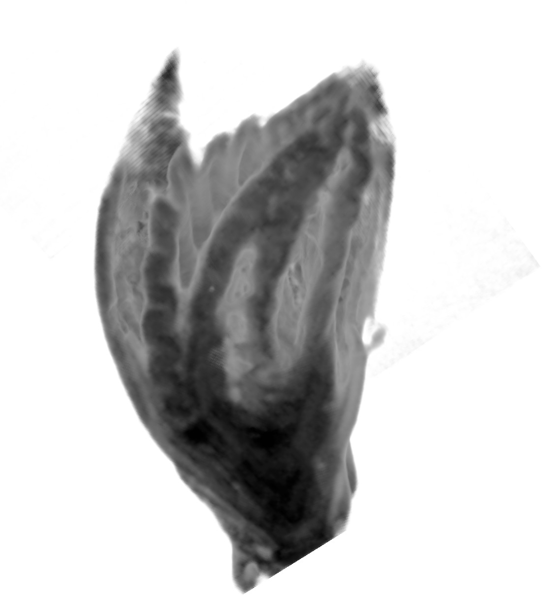

# Arduino-based serial episcopic imaging for 3-D reconstruction of tissue morphology

## Zachary R. Lewis


# Motivation

I wanted to perform 3-D tissue reconstruction with minimal post-imaging
alignment and minimal cost. Micro-CT and histological reconstruction are both
great ways to analyze 3-D tissue morphology. However, Micro-CT systems are
expensive to purchase and operate and have limited resolution. Histological
reconstruction is inexpensive. However, histological reconstruction relies on
sectioning, mounting, staining and imaging sections. During section mounting
and staining the tissue is distorted. The sections then need to be aligned
after imaging, which is difficult and sometimes impossible due to distortion. 

## Advantages of episcopic surface imaging

Episcopic surface imaging involves taking a series of pictures of the face of a block of embedded
tissue prior to sectioning the tissue on a microtome. The block is then cut with a microtome, removing
a thin section and exposing a deeper layer of tissue. The block is imaged again and through 
successive rounds of cutting and imaging a 3-D model of the tissue can be generated.
Episcopic surface imaging is also known as high resolution episcopic microscopy. 
Imaging a sample while it is embedded inside of a tissue block eliminates
artifacts due to distortion, allowing easy alignment (registration) of the slices. 
The sections can be made thinner than conventional histological sections.
Furthermore, with surface imaging the sections do not need to be mounted
on slides and stained. There may be compromises in terms of image quality
with surface imaging compared to transmitted light imaging of histological
sections. However, surface imaging can accommodate a number of different
tissue types, sizes and stains (preferably fluorescent stains). 

# Methods

## Constructing the electronics

I leaned heavily on this excellent webpage discussing utilizing opto-isolators for 
activating camera shutter remotes: http://www.martyncurrey.com/activating-the-shutter-release/


### Materials

Required components:

- Arduino UNO
- [Opto-isolator (FL817C used here)](https://www.amazon.com/uxcell-2-54mm-Pitch-Mounting-Coupler/dp/B00S4YRMB4/ref=sr_1_1?ie=UTF8&qid=1489681887&sr=8-1&keywords=optocoupler)
- Tactile button
- Resistors
- Microscope
- Manual rotary microtome (with stationary knife)
- Mirror
- Digital camera with wired remote capabilities
- Camera remote cable 
    + (Note that here I use Canon EOS digital SLR that uses a 2.5 mm audio cable as a wired remote. I stripped the cable and determined which lead was ground, shutter and focus. Focus is not needed here.)
    + If a wired remote is not a possibility, then consider making an IR remote. You simply need to download the appropriate control sequence for your camera. Use an NPN transistor to control your IR LED.


Optional components:

- [RGB LED (common anode)](https://www.adafruit.com/product/2739)
- [LED Minimatrix](https://www.adafruit.com/product/3150)

### Circuit:




### Programming the Arduino
---
```c++
/*
 * Opto-isolated circuit for high resolution episcopic microscopy
 * by Zack Lewis
 * Apr. 2017
 * 
 * A trigger in the form of a tactile button is attached to a rotary microtome. 
 * The button activates the opto-isolator at a set point during the rotation of  
 * the microtome. The phototransistor (output) side of the opto-isolator fires
 * the camera shutter.
 * 
 */
 
#include <Wire.h>
#include <Adafruit_GFX.h>
#include "Adafruit_LEDBackpack.h"
#include <Button.h> //from https://github.com/JChristensen/Button

//telling arduino what type of LED matrix:
Adafruit_8x16minimatrix matrix = Adafruit_8x16minimatrix(); 

int STATUS_LED = 13; // use built in LED as an additional status light
int OPTO_PIN = 11;   // connect optocoupler pin 1 to arduino pin 11
//pins for the rgb LED:
int redPin = 5;
int greenPin = 6;
int bluePin = 7;
#define COMMON_ANODE //the LED has a common anode. Connect pin 2 to +5V

//initialize counter to 0
int counter = 0;

#define n 1                //number of images to take
#define preDelay 1000      //sets the delay after button is pressed and prior to image capture
                                //this allows block time to stop moving and prevents blur
                                
#define BUTTON_PIN 12      //Connect a tactile button switch from Arduino pin 12 to ground.
#define PULLUP true        //Can use the Arduino's internal pullup resistor. Here I've put a resistor in the circuit
#define INVERT false       //Since the pullup resistor will keep the pin high unless the
                           //switch is closed, this is negative logic, i.e. a high state
                           //means the button is NOT pressed. (Assuming a normally open switch.)
#define DEBOUNCE_MS 20     //A debounce time of 20 milliseconds usually works well for tactile button switches.

Button myBtn(BUTTON_PIN, PULLUP, INVERT, DEBOUNCE_MS);  //from Button library

void setup()
{
  Serial.begin(9600);
  pinMode(BUTTON_PIN, INPUT);
  pinMode(OPTO_PIN, OUTPUT);
  pinMode(STATUS_LED, OUTPUT);

//pinModes for the LED:
  pinMode(redPin, OUTPUT);
  pinMode(greenPin, OUTPUT);
  pinMode(bluePin, OUTPUT);  

  matrix.begin(0x70);  // pass in the address to the LED matrix
}

void loop() {
myBtn.read(); // read the state of the pushbutton value:
setColor(255, 0, 255); //set color of RGB LED to purple
 
  // check if the pushbutton was pressed.
  //            options: if(myBtn.isPressed()){
  //                     if(myBtn.pressedFor(500)){
  //                     if(myBtn.wasPressed()){
 
  if(myBtn.wasPressed()){
      setColor(0, 255, 0);  //change color of RGB LED to Green during imaging
      delay(preDelay);      //delay prior to imaging to reduce blur
      takeAnImage(n);       //fire the camera shutter
      writeMatrix();        //write the counter value to the LED matrix
     
      } 
}


void takeAnImage(int imageNumber){
 
  digitalWrite(STATUS_LED, HIGH);
  
  for(int i = 0; i<imageNumber; i++){
    
    counter++; //increment the counter

    //take an image by setting OPTO_PIN to HIGH
    digitalWrite(OPTO_PIN, HIGH);
    delay(100); //delay can be adjusted so that camera fires

    //print counter to serial monitor
    Serial.print("Counter: ");Serial.println(counter);

    //turn off STATUS_LED, turn off OPTO_PIN
    digitalWrite(STATUS_LED, LOW);
    digitalWrite(OPTO_PIN, LOW);
    
    //set RGB LED to aqua
    setColor(0, 255, 255); //aqua
    delay(500); //delay not actually needed, but indicates that the shutter is open

  }
}

//code below to display counter value on an LED matrix:

void writeMatrix(){
   
  matrix.setRotation(1);
  matrix.setTextSize(1);
  matrix.setTextWrap(false);  // we dont want text to wrap so it scrolls nicely
  matrix.setTextColor(LED_ON);

//printing to a matrix without scrolling. Will cut off part of number after 99
        
      matrix.clear();
      matrix.setCursor(0,0);
      matrix.print(counter); //could do counter/10 to display just a portion
      matrix.writeDisplay();

// scrolling functionality below. Doesn't work unless there is a delay, which impedes the button accuracy.  
//  for (int8_t x=0; x>=-64; x--) {
//   
//    matrix.clear();
//    matrix.setCursor(x,0);
//    matrix.print(counter);
//    matrix.writeDisplay();
//    
//    //delay(10); //any sort of delay here impedes the button accuracy
//  }
}

//code to set LED color:

void setColor(int red, int green, int blue)
{
  #ifdef COMMON_ANODE
    red = 255 - red;
    green = 255 - green;
    blue = 255 - blue;
  #endif
  analogWrite(redPin, red);
  analogWrite(greenPin, green);
  analogWrite(bluePin, blue);  
}
```
---
### Instrumenting the microtome

The entire episcopic surface imaging setup is depicted below.



The microtome is an AO Spencer 820 manual rotary microtome, which can be purchased online 
for cheap (around $200). For this setup the knife is stationary, meaning that the block face remains in 
the same focal plane from image to image. The specimen arm is parallel to the ground.

#### Trigger

I attached the tactile button, mounted on a circuit board, to the microtome so that it 
would be depressed when the specimen is at the upper extreme of its trajectory.





#### Mirror

In contrast to typical episcopic surface imaging where the microscope objective is mounted parallel to the sample, 
I employed a mirror at a 45 degree angle so that the microscope could sit vertically at its natural position, 
which is perpendicular to the sample.



A rear-silvered glass mirror is depicted here, but a metal mirror with front reflection was later used. A front-silvered mirror may improve image quality.

#### Microscope

An Olympus SZX16 with epifluorescence was used. Images were captured using a Canon EOS digital SLR.

## Tissue embedding

I used the protocol listed here for embedding: https://dmdd.org.uk/hrem/

### Embedding materials
- [JB-4 resin embedding kit](www.polysciences.com/default/catalog-products/life-sciences/histology-microscopy/plastic-embedding-media-kits/jb-4-sup-r-sup-embedding-kits-reagents/jb-4supsup-embedding-kit/)
- Eosin B
- Acridine orange (recommended, but not used here)
- Methanol
- Embedding molds
- 5 minute epoxy
- Specimen chuck

### Embedding method

#### Dye Mix preparation
1. Prepare JB-4 Dye Mix by dissolving 1.25% (w/v) catalyst into Solution A using a stir 
plate on high speed. Slowly add 0.275% (w/v) of Eosin B while mixing. Mix solution for at 
least an hour at room temperature (4 hours recommended), then place at 4C overnight.
2. Filtering is recommended, but no dye particles were observed.
3. Store Dye Mix at 4C. It should be stable for 2 - 3 weeks.

#### Tissue infiltration
4. Starting from a fixed specimen, wash out any fixative with an appropriate buffer.
5. Slowly dehydrate specimen in methanol at 10% increments (e.g., 10%, 20%, 30%, ..., 100%). The methanol should be diluted with the buffer you used to wash the specimen. I used 1 hour washes, but the duration is dependent on the size of the tissue.
6. Perform several long washes in 100% methanol.
7. Immerse the specimen overnight in a 50:50 mix of 100% methanol:Dye Mix.
8. Rinse the sample with 100% Dye Mix, then exchange this Dye Mix for fresh 100% Dye Mix. 
9. Incubate specimen at 4C until fully infiltrated. I waited for 3 days, though it is likely faster for small specimens.

#### Embedding
10. Add 0.6 mL of JB-4 Solution B to the cold Dye Mix and mix very well. Vortexing works fine.
11. Fill the embedding molds with this mixture and add your specimen. 
12. The mixture will start to polymerize within about 10 minutes. Orient your specimen before the mixture is too polymerized because manipulation of the specimen once the JB-4 polymerization is more advanced will leave streaks in the resin. 
13. JB-4 polymerization needs to occur in an oxygen-free environment. To achieve this, you can place your specimens in a vacuum chamber and flood it with nitrogen. More simply, you can just add a layer of mineral oil to the top of your embedding mold. 
14. Place your specimens in a dark place at room temperature to polymerize overnight.
15. Invert mold and wipe away any remaining mineral oil. The exposed portion of the block may not be completely polymerized. This is okay. You can microwave it for a few seconds to harden it, or just wipe off any JB-4 that is not polymerized. Longer incubation under mineral oil may help with polymerization. If polymerization did not occur your JB-4 may need to be replaced or you may have incorrectly mixed it.
16. Remove specimen block from the mold and trim using a razor blade.
17. Mix together 5 minute epoxy. Mount trimmed block on the wooden chuck using the epoxy.

## Sectioning and Imaging

1. Once the epoxy has set, place your chuck into the specimen clamp of the microtome. 
2. Adjust position of the specimen arm and knife. Adjust the angle of the chuck to be perpindicular to the knife. 
3. Place mirror in a clamp and adjust it's angle to 45 degrees using a carpenter's square.
4. Advance the block until it is just shy of contacting the knife. Square off the block.
5. Move microscope and mirror into position. Adjust the height of the mirror and microscope to visualize the block face at the top (locked) position in the microtome.
6. Adjust focus using the camera. 
7. Illuminate the sample with epifluorescent illumination for GFP. Note that epifluorescent illumination is not absolutely necessary and may be inappropriate for some applications.
8. Adjust exposure on the camera.
9. Plug in the Arduino, trigger and camera remote cable. Test the setup by rotating the microtome through several sections to ensure that the shutter fires appropriately.
10. Turn off overhead lights and begin sectioning, being careful not to move the camera, mirror, or microtome. Try to keep lighting as consistent as possible from image to image.

## Results

The following dataset was obtained from a leaf bud of _Viburnum dentatum_ sectioned at 5um
thickness. 
No post-imaging alignment was used. The images were cropped, downsampled and
contrast-adjusted in Photoshop then imported into Amira.

Volume rendering of a leaf bud:


Sections through the sample and a volume rendering:
[ Movie 1 ]( https://youtu.be/NxrEc0CkRQM ) 

Spinning volume rendering of a leaf bud:
[ Movie 2 ]( https://youtu.be/Sc_PcjsgytI ) 

Orthoslices through a volume rendering from bud tip to base:
[ Movie 3 ]( https://youtu.be/fHgu-WmEwhg )

